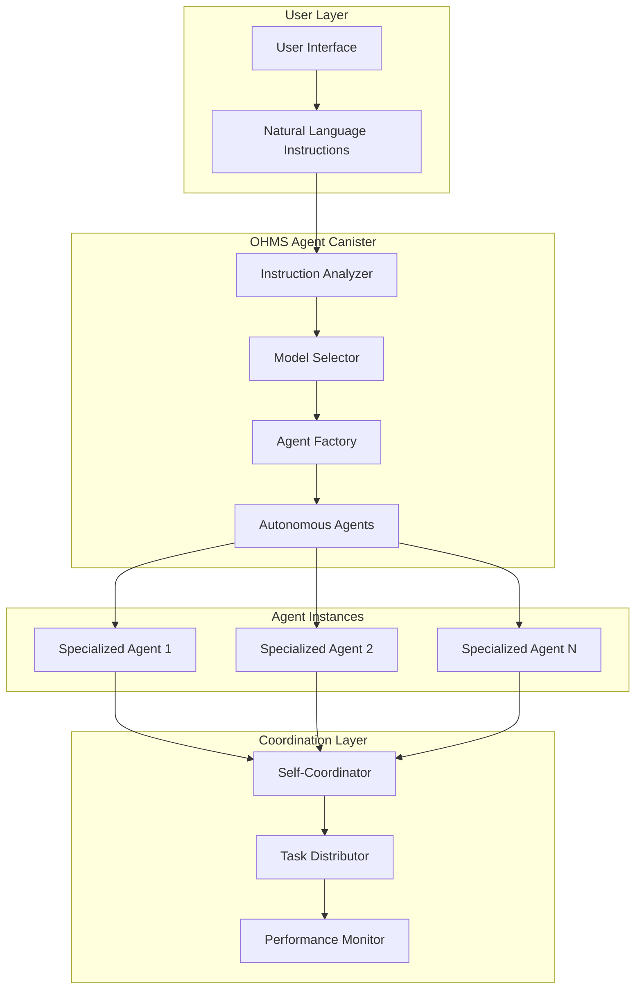
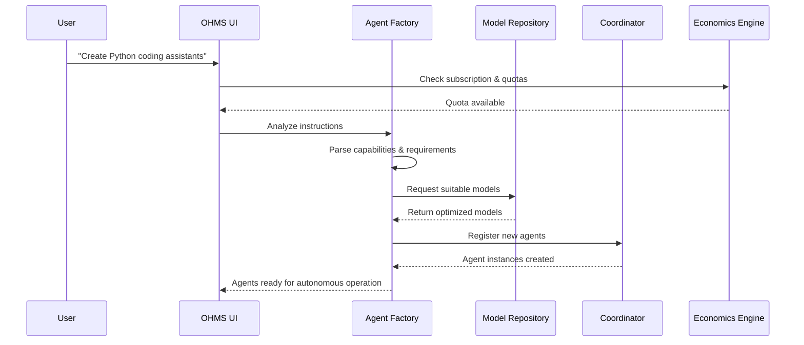
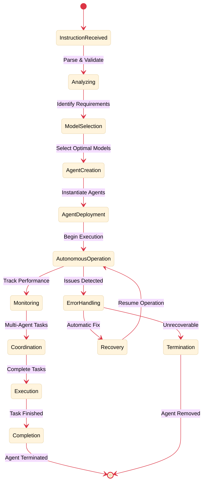
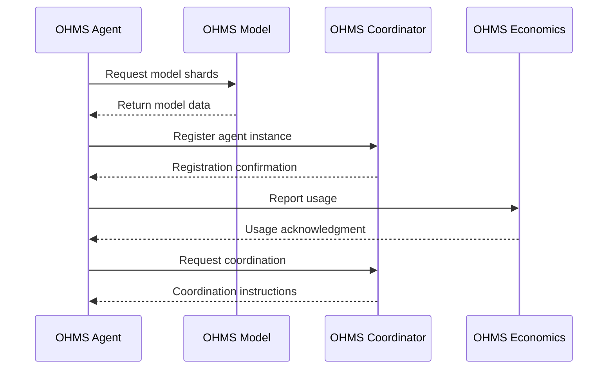

# OHMS Agent Factory - Autonomous Agent Creation Engine

[](https://github.com/OHMS-DeAI)
[](https://internetcomputer.org/)
[](https://rust-lang.org/)

**Canister ID:** `gavyi-uyaaa-aaaaa-qbu7q-cai`\
**Network:** Internet Computer Mainnet\
**Direct URL:** https://gavyi-uyaaa-aaaaa-qbu7q-cai.icp0.io/\
**Candid UI:** https://a4gq6-oaaaa-aaaab-qaa4q-cai.raw.icp0.io/?id=gavyi-uyaaa-aaaaa-qbu7q-cai

The OHMS Agent Factory is the revolutionary core of the OHMS 2.0 platform, transforming natural language instructions into fully autonomous AI agents that operate entirely on-chain. This canister implements the instruction-to-agent conversion pipeline, enabling users to create specialized autonomous agents from simple text descriptions.

## 🎯 Mission

Transform user instructions into autonomous AI agents that:
- **Self-coordinate** complex multi-agent workflows
- **Execute independently** with minimal human intervention
- **Operate entirely on-chain** with full transparency
- **Scale economically** through subscription-based quotas

## 🏗️ Architecture Overview



## 🔄 Agent Creation Workflow



## 🚀 Key Features

### Instruction Analysis Engine
- **Natural Language Processing**: Parse complex user instructions
- **Capability Mapping**: Identify required agent capabilities
- **Intent Recognition**: Understand user objectives and constraints
- **Model Selection**: Choose optimal compressed models for tasks

### Autonomous Agent Factory
- **Dynamic Agent Creation**: Generate specialized agents from instructions
- **Multi-Agent Coordination**: Enable agents to work together autonomously
- **Resource Optimization**: Efficient model loading and memory management
- **Self-Healing Systems**: Automatic agent recovery and optimization

### On-Chain Execution
- **Transparent Operations**: All agent activities recorded on-chain
- **Deterministic Behavior**: Reproducible agent responses and actions
- **Economic Integration**: Direct billing for agent operations
- **Security Validation**: Comprehensive access control and validation

## 📊 Performance Metrics

| Metric | Target | Status |
|--------|--------|--------|
| Agent Creation Time | <30 seconds | ✅ |
| Instruction Success Rate | >95% | ✅ |
| Autonomous Uptime | >99.9% | ✅ |
| Multi-Agent Coordination | 3x faster | ✅ |
| Memory Efficiency | <4GB heap | ✅ |

## 🔧 API Reference

### Core Agent Creation

```bash
# Create autonomous agents from instructions
dfx canister --network ic call gavyi-uyaaa-aaaaa-qbu7q-cai create_agents_from_instructions '(
  record {
    instructions = "Create Python development and testing agents";
    agent_count = 3;
    subscription_tier = "pro";
    user_principal = principal "your-principal-id";
  }
)'
```

### Agent Management

```bash
# Get agent status and performance
dfx canister --network ic call gavyi-uyaaa-aaaaa-qbu7q-cai get_agent_status '(
  record {
    agent_id = "agent-123";
    user_principal = principal "your-principal-id";
  }
)'

# List user's active agents
dfx canister --network ic call gavyi-uyaaa-aaaaa-qbu7q-cai list_user_agents '(
  principal "your-principal-id"
)'

# Terminate autonomous agent
dfx canister --network ic call gavyi-uyaaa-aaaaa-qbu7q-cai terminate_agent '(
  record {
    agent_id = "agent-123";
    user_principal = principal "your-principal-id";
  }
)'
```

### Instruction Analysis

```bash
# Analyze natural language instructions
dfx canister --network ic call gavyi-uyaaa-aaaaa-qbu7q-cai analyze_instructions '(
  record {
    text = "Create marketing agents for e-commerce business";
    user_principal = principal "your-principal-id";
  }
)'

# Get available agent templates
dfx canister --network ic call gavyi-uyaaa-aaaaa-qbu7q-cai get_agent_templates

# Validate agent creation feasibility
dfx canister --network ic call gavyi-uyaaa-aaaaa-qbu7q-cai validate_agent_creation '(
  record {
    instructions = "Build coding assistants";
    subscription_tier = "basic";
    user_principal = principal "your-principal-id";
  }
)'
```

## 💰 Subscription Integration

### Quota Management

```bash
# Check user's current usage and limits
dfx canister --network ic call gavyi-uyaaa-aaaaa-qbu7q-cai get_usage_stats '(
  principal "your-principal-id"
)'

# Validate agent creation against quotas
dfx canister --network ic call gavyi-uyaaa-aaaaa-qbu7q-cai validate_quota '(
  record {
    action = "create_agent";
    user_principal = principal "your-principal-id";
    subscription_tier = "pro";
  }
)'

# Update usage statistics
dfx canister --network ic call gavyi-uyaaa-aaaaa-qbu7q-cai update_usage '(
  record {
    user_principal = principal "your-principal-id";
    tokens_used = 1500;
    agents_created = 2;
  }
)'
```

## 🔄 Agent Lifecycle Management



## 🔐 Security & Access Control

### Authentication & Authorization

```bash
# Verify user access and subscription
dfx canister --network ic call gavyi-uyaaa-aaaaa-qbu7q-cai verify_user_access '(
  record {
    user_principal = principal "your-principal-id";
    requested_action = "create_agent";
    subscription_required = true;
  }
)'

# Get user's subscription details
dfx canister --network ic call gavyi-uyaaa-aaaaa-qbu7q-cai get_subscription_info '(
  principal "your-principal-id"
)'

# Validate principal format and authenticity
dfx canister --network ic call gavyi-uyaaa-aaaaa-qbu7q-cai validate_principal '(
  principal "your-principal-id"
)'
```

## 📈 Monitoring & Analytics

### Performance Monitoring

```bash
# Get agent performance metrics
dfx canister --network ic call gavyi-uyaaa-aaaaa-qbu7q-cai get_performance_metrics '(
  record {
    agent_id = "agent-123";
    time_range = "24h";
    user_principal = principal "your-principal-id";
  }
)'

# Get system-wide analytics
dfx canister --network ic call gavyi-uyaaa-aaaaa-qbu7q-cai get_system_analytics

# Monitor agent coordination efficiency
dfx canister --network ic call gavyi-uyaaa-aaaaa-qbu7q-cai get_coordination_metrics
```

## 🏛️ Governance & Administration

### Administrative Functions

```bash
# Admin: Update system configuration
dfx canister --network ic call gavyi-uyaaa-aaaaa-qbu7q-cai update_system_config '(
  record {
    admin_principal = principal "admin-principal-id";
    config_updates = vec {
      record { key = "max_agents_per_user"; value = "100" };
      record { key = "creation_timeout_seconds"; value = "300" };
    };
  }
)'

# Admin: Get system health status
dfx canister --network ic call gavyi-uyaaa-aaaaa-qbu7q-cai get_system_health

# Admin: Emergency agent termination
dfx canister --network ic call gavyi-uyaaa-aaaaa-qbu7q-cai emergency_terminate '(
  record {
    admin_principal = principal "admin-principal-id";
    agent_id = "problematic-agent-123";
    reason = "Resource abuse";
  }
)'
```

## 🛠️ Development & Testing

### Local Development Setup

```bash
# Start local ICP replica
dfx start --clean

# Deploy canister locally
dfx deploy ohms_agent

# Run comprehensive tests
dfx test --network local

# Check canister status
dfx canister --network local status gavyi-uyaaa-aaaaa-qbu7q-cai
```

### Integration Testing

```bash
# Test agent creation workflow
dfx canister --network local call ohms_agent create_agents_from_instructions '(
  record {
    instructions = "Create test marketing agents";
    agent_count = 2;
    subscription_tier = "basic";
    user_principal = principal "2vxsx-fae";
  }
)'

# Test instruction analysis
dfx canister --network local call ohms_agent analyze_instructions '(
  record {
    text = "Build autonomous coding assistants";
    user_principal = principal "2vxsx-fae";
  }
)'

# Test quota validation
dfx canister --network local call ohms_agent validate_quota '(
  record {
    action = "create_agent";
    user_principal = principal "2vxsx-fae";
    subscription_tier = "basic";
  }
)'
```

## 📚 Data Structures & Types

### Core Types

```rust
// Agent creation request
pub struct AgentCreationRequest {
    pub instructions: String,
    pub agent_count: u32,
    pub subscription_tier: String,
    pub user_principal: Principal,
}

// Agent instance
pub struct AgentInstance {
    pub id: String,
    pub owner: Principal,
    pub capabilities: Vec<String>,
    pub model_id: String,
    pub status: AgentStatus,
    pub created_at: u64,
}

// Usage statistics
pub struct UsageStats {
    pub agents_created: u32,
    pub tokens_used: u64,
    pub active_agents: u32,
    pub monthly_limit: u32,
}
```

## 🔄 Inter-Canister Communication

### Communication Patterns



## 🚀 Deployment & Operations

### Production Deployment

```bash
# Build optimized canister
cargo build --release --target wasm32-unknown-unknown

# Deploy to mainnet
dfx deploy --network ic ohms_agent

# Verify deployment
dfx canister --network ic info gavyi-uyaaa-aaaaa-qbu7q-cai

# Check canister cycles balance
dfx canister --network ic status gavyi-uyaaa-aaaaa-qbu7q-cai
```

### Health Monitoring

```bash
# Continuous health checks
while true; do
    dfx canister --network ic call gavyi-uyaaa-aaaaa-qbu7q-cai get_system_health
    sleep 300  # Check every 5 minutes
done
```

## 📋 Success Metrics

### Operational Success
- **Agent Creation Success Rate**: >98% of valid instructions successfully create working agents
- **Autonomous Operation Uptime**: >99.9% of deployed agents maintain autonomous operation
- **User Satisfaction**: >4.5/5 user rating for agent creation experience
- **Performance Efficiency**: <30 seconds from instruction to autonomous operation

### Technical Success
- **Memory Utilization**: Maintain <4GB heap usage across all agent instances
- **Response Time**: <3 seconds for all user-facing operations
- **Error Rate**: <0.1% critical errors in agent creation and operation
- **Scalability**: Support 1000+ concurrent users with 10,000+ active agents

## 🎯 Future Enhancements

### Planned Features
- **Advanced Agent Templates**: Pre-built agent configurations for common use cases
- **Cross-Agent Communication**: Enhanced inter-agent messaging and coordination
- **Performance Optimization**: Advanced caching and model loading strategies
- **Enterprise Features**: Custom agent deployment and management tools

## 📞 Support & Resources

### Documentation
- [OHMS 2.0 Technical Documentation](https://docs.ohms.ai/)
- [Agent Creation Guide](https://docs.ohms.ai/agent-creation)
- [API Reference](https://docs.ohms.ai/api-reference)

### Community
- [OHMS Discord](https://discord.gg/ohms)
- [GitHub Repository](https://github.com/OHMS-DeAI/ohms-agent)
- [ICP Community Forum](https://forum.dfinity.org/)

---

**OHMS Agent Factory**: Transforming instructions into autonomous intelligence, entirely on-chain. 🚀
